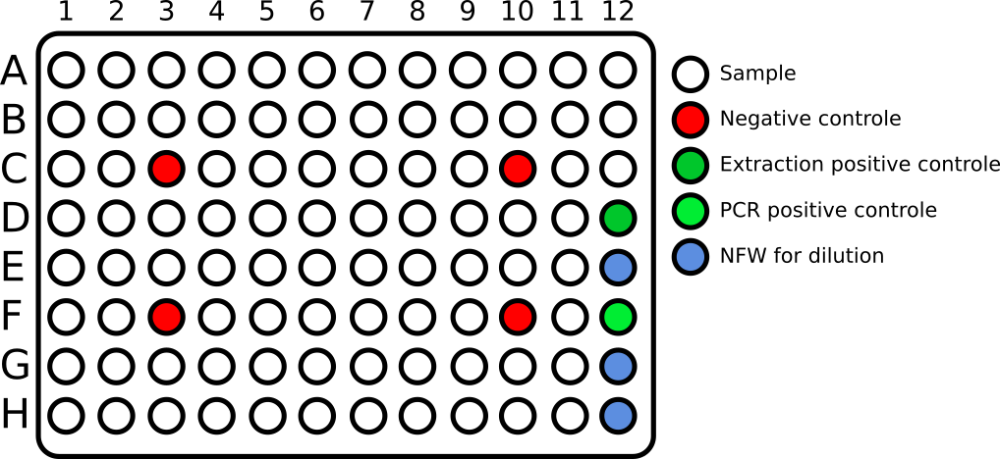
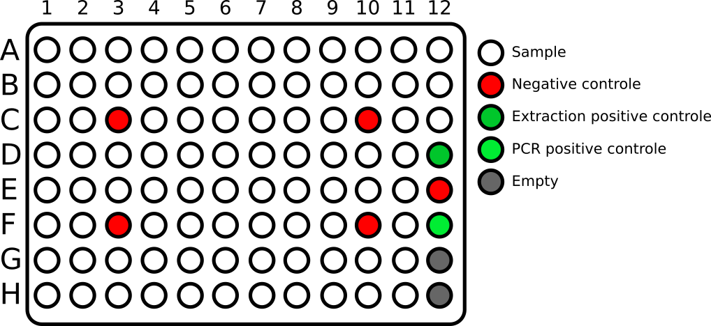
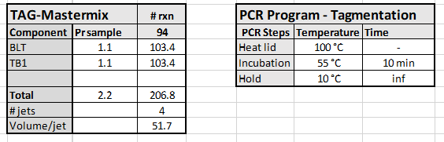
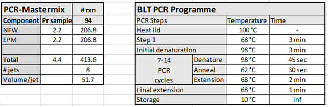

# HT Downscaled Illumina Metagenomes Protocol

This repository describes the high throughput downscaled Illumina Metagenomes Protocol described in **ATICLE**. This repository describes a step-by-step guide for making metagenomes in a high-throughput setting using a 1:10 downscaled version of the Illumina DNA prep kit.

## Equipment and consumables
- I-DOT one
    + S.100 source plate
    + PUREPlate 200 wells
- PCR target plates
- epMotion:R:96
    + epMotion tips
- Illumina DNA prep and IDT UD barcodes
- Eppendorf electronic multipipette
- Centrifuge plate spinner for PCR plates
- Magnetic stand.

## Plate layouts
To understand the individual steps in the protocol, it is necessary to understand the input and output layouts of the plates resulting from the I-DOT.

### DNA extraction plate
The first step is to create a 3 ul reaction volume with 20 ng of DNA or less, based on the DNA extraction concentration. The layout of the DNA extraction plate is as follows:

To perform dilution with the I-DOT one a CSV file needs to be provided with the required DNA input amount from each well and dilution amount. The `files/dna_extraction_concentration.xlsx` calculates the required DNA input and and dilution volume based on the DNA extraction concentration, which is the input to creating the `files/idot_CSV_dilution_template.csv`.

### DNA dilution source plate
The layout of the source plate is as follows:

The source plate has 3 wells with NFW, E12, G12, and H12, which are used to dilute all other samples. Thus if well A1 requires 2 ul sample for a 20 ng DNA input, 1 ul NFW will be added from one of the dilution wells.

### DNA target plate
The layout of the target plate after addition of sample and NFW is as follows:

Each well contains a 3 ul reaction volume.

## Protocol
### Tagementation
- Copy data from the `files/DNA_extraction_concentration.xlsx` and fill out the CSV template – `files/idot_CSV_dilution_template.csv`.
- Delete all rows containing 0 µL in `files/idot_CSV_dilution_template.csv`.
- Load 10 µL sample onto a S.100 source plate using the EP-motion (grey tips).
- Add 7 µl PCR positive control in F12
- Add 80 µL NFW to the dilution wells; E12, G12, H12.
- Place the source plate and PCR target plate in the I-DOT and run the `files/idot_CSV_dilution_template.csv`.
- After dilution, remove the source plate, and clean the underside of the source tray with ethanol solution.
- Prepare the BLT/TB1 mastermix and add 51.7 ul to four PUREplate200 source jets (A1-D1) in a source plate.
- Place the BLT/TB1 source plate in the I-DOT and run the `files/BLT_TB1_additions.idot` file. This will add 2 ul BLT/TB1.
- Remove the `DNA target plate` from the I-DOT
    + Foil the plate, vortex, and briefly spin (Henceforth referred to as FVS)
- Place in a thermocycler and run the TAG programme

### Stop tagmentation
- Retrieve the plate from the thermocycler
- Spin down.
- Place in the I-DOT target tray.
- Load 50 ul of TSB into two S.100 jets (A6-B6) and place into the source tray of the I-DOT.
- Run the `files/TSB_addition.idot`. This will add 1 ul of TSB to each well
- Take out the target plate and FVS.
- Place in a thermocycler and run the PTC programme:
    + Preheat lid to 100 ⁰C.
    + 37 ⁰C for 15 minutes.
    + Hold at 10 ⁰C.
- Spin the plate.

### Post tagmentation cleanup
- Place the tubes on a magnetic stand and wait until liquid is clear (~2 min).
- Aspirate 13 µL and discard the supernatant using the epMotion.
- Wash two times as follows:¨
    1. Remove the sample plate from the magnetic stand and slowly add 10 µL Tagment wash buffer (TWB) directly onto the beads with the Eppendorf electronic multipipette.
    2. FVS
    3. Place the plate on the magnetic stand and wait until the liquid is clear (~2 minutes).
    4. Remove 13 µL and discard supernatant with the epMotion.
    5. Repeat step i-iv
- Remove the plate from the magnetic stand and add 10 µL TWB directly onto the beads using the Eppendorf electronic multipipette.
- FVS
- Place the samples on a magnetic stand until the liquid is clear (~2 minutes).

### Amplify tagmented DNA
- Prepare the PCR-mastermix:

- Add 51.7 ul PCR-mastermix to eight S.100 source jets (A9-H9) and place in the source tray of the I-DOT.
- Aspirate 15 ul TWB with the epMotion and place in the target tray of the I-DOT.
- run the `files/PCR-mix_addition.idot`.
- Take out the target plate and FVS.
- Add 1 ul barcodes.
- FVS
- Move samples needing 8, 10, and 14 PCR cycles to individual PCR tubes. Denoted in `files/DNA_extraction_concentration.xlsx`.
    + **7**: >= 4.9 ng
    + **8**: 2.5 - 4.9 ng
    + **10**: 0.9 - 2.5 ng
    + **14**: < 0.9 ng 
- Replace foil on the plate with plastic PCR caps to prevent vaporization.
- Place all samples in a thermocycler and run PCR programme based on the PCR cycles required.
- Move samples requiring extra cycles back to the PCR plate.

**Safe stopping point**

## Library cleanup
- Add 17 ul NFW to each well.
- FVS.
- Place the plate on the magnetic stand and wait until the liquid is clear (~2 minutes).
- Prepare a new PCR plate containing 16 ul sample purification beads (SPB) and 18 ul NFW.
- Transfer 18 ul supernatant from the sample plate to the new PCR plate with diluted SPB using the epMotion.
    + Discard the sample plate.
- FVS.
- Incubate at room temperature for 5 minutes.
- Place the plate on the magnetic stand and wait until the liquid is clear (~2 minutes).
- Add 6 ul undiluted SPB to a new PCR plate
- After incubation transfer 50 µL supernatant from each well of the first PCR plate into the corresponding well of the new PCR plate with undiluted SPB - Use the epMotion.
- FVS.
- Incubate at room temperature for 5 minutes.
- Place on the magnetic stand and wait until the liquid clears (~2 minutes).
- Without disturbing the beads, remove and discard 54 µL supernatant by hand.
- Wash two times as follows:
    1. Gently add 45 µL 80% EtOH to the beads by hand.
    2. Incubate for 30 seconds.
    3. Remove and discard the supernatant (50 µL) using the epMotion
    4. Repeat steps i-iii
    5. Use a 10 μL pipette to remove residual EtOH by hand if necessary.
- Air dry on the magnetic stand for 2-3 minutes.
- Remove from the magnetic stand
- Add 20 ul NFW by hand.
- FVS.

**Safe stopping point**

## Pooling of libraries
### Measure concentration of libraries
- Place the plate on the magnetic stand and wait until the liquid clears (~2 minutes).
- Measure the library concentration using Qubit 1x dsDNA High Sensitivity Assay.
- Add the measured concentration to the `files/library_concentration.xlsx` template. 
- Copy the Vsample column to the `files/idot_pooling.csv` template.

### Pooling of libraries
- Transfer 15 ul sample to a new S.100 source plate using the epMotion and place in the source tray of the I-DOT.
- Place a PCR plate in the target position of the I-DOT.
- Run the `idot_pooling.csv` file. 2 ng DNA or a maximum of 9 ul from each sample will be transfered to the PCR target plate.
- Remove the target place from the PCR and transfer the liquids to a 2 ml eppendorf tube.

### Concentrate library pool
- Measure the volume of the library pool.
- Add pronex beads corresponding to 2x the volume of the pool.
- Mix until homogenized.
- Incubate for 10 minutes on the HULA-mixer.
- Place the tube on a magnet and let the beads pellet for 2 minutes.
- Remove the supernatant.
- Leaving the sample on the magnetic stand, wash two times with 800 µL enclosed Wash Buffer.
- Remove residues of wash buffer with a 10 µL pipette. 
- Air dry the beads for 5 minutes.
- Remove the tube from the magnet and add 65 µL NFW. 
- Mix by flicking
- Incubate the sample at room temperature for 5 minutes to elute the DNA.
- Spin down the tube and place it on a magnet.
- Transfer the supernatant to a new eppendorf tube.

## Final
At this point, a concentrated pool of libraries has been made. Next steps would be measuring the concentration and running a tapestation to assess quality of the pooled libraries.

